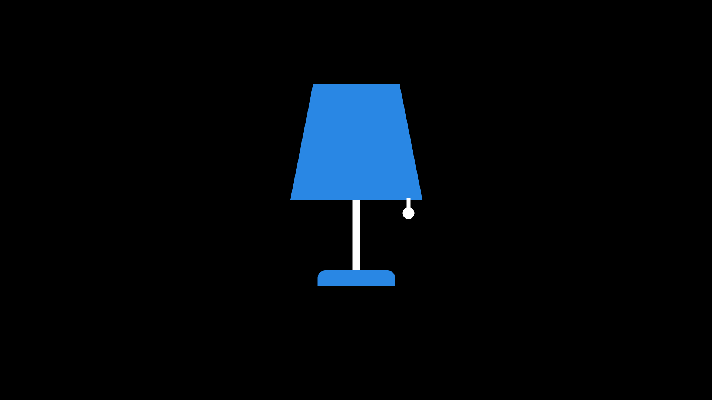
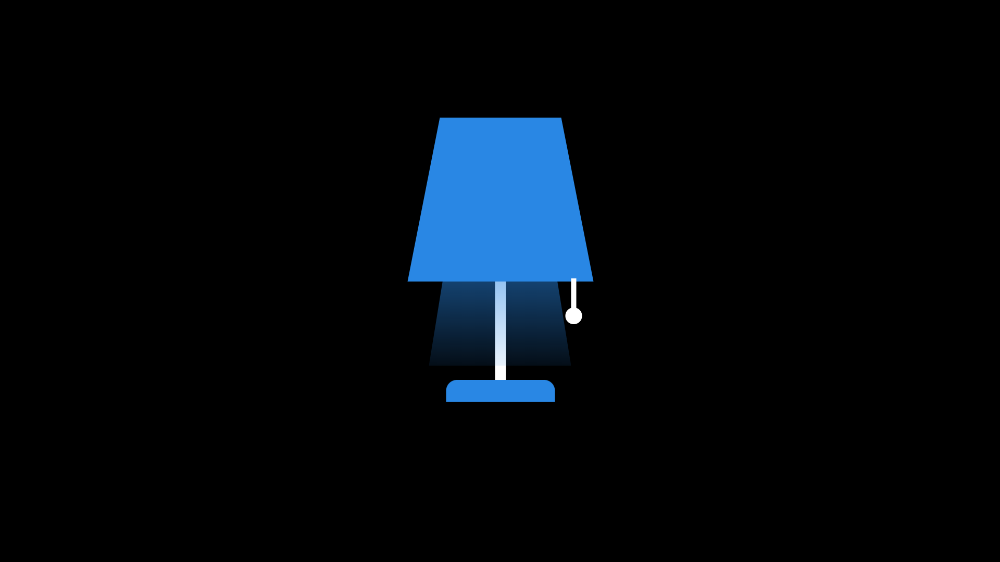

## 💡 Lamp

  
  

This project is a reconstruction of one of my first experiences with JavaScript.

It serves as a great starting point to revisit fundamental concepts and regain familiarity with the syntax. At this stage, the focus is on rebuilding old projects with greater quality and intention.

This time, all visual elements were created using CSS, unlike the original version built in the past, which used alternating images to represent the light bulb being on and off.

Reference used:
[https://youtu.be/Gy2BP857030](https://youtu.be/Gy2BP857030)

Some adaptations were made, including responsive versions for testing on mobile devices and the addition of sound effects. The idea is for this project to be integrated into a more complete portfolio page, where projects are presented similarly to apps in an app store, prioritizing a more visually appealing and organized presentation.

## 🇧🇷 Português

Este projeto é a reconstrução de um dos meus primeiros contatos com JavaScript.

Ele funciona como um ótimo ponto de recomeço, ajudando a revisitar conceitos fundamentais e retomar a familiaridade com a sintaxe. Nesta fase, o foco está em refazer projetos antigos com mais qualidade e intenção.

Desta vez, todos os elementos visuais foram construídos com CSS, diferentemente da primeira versão montada no passado, que utilizava imagens alternadas para representar a lâmpada acesa e apagada.

Referência utilizada:
[https://youtu.be/Gy2BP857030](https://youtu.be/Gy2BP857030)

Foram feitas algumas adaptações, incluindo versões responsivas para testes em dispositivos móveis e efeitos sonoros. A ideia é que este projeto se integre a uma página de portfólio mais completa, onde os projetos serão apresentados de forma semelhante a aplicativos em uma loja de apps, priorizando uma apresentação visual mais atraente e organizada.