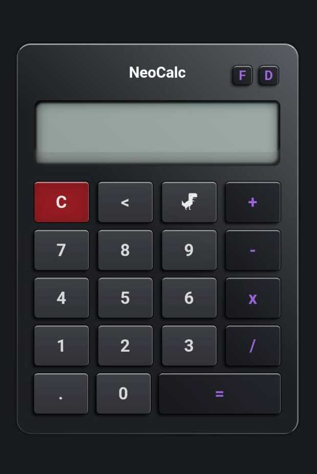
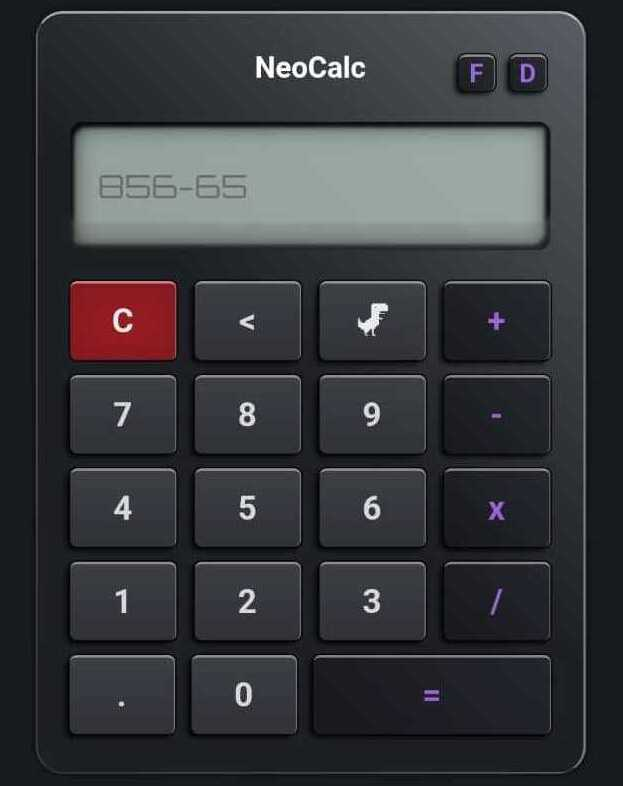
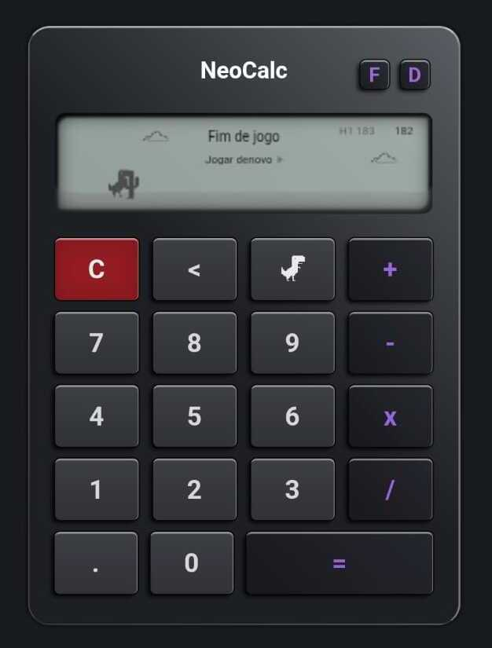

# NeoCalc

  
  
  

## About this project

This project is part of a personal initiative to revisit and rebuild past projects in more refined versions. The goal is to reinforce essential concepts while getting back into studying, while also evolving technically by building something that, although simple in concept, carries intention and attention to detail in every aspect.
As the second project in this new phase, I developed a calculator that integrates an internal mini game. The calculator itself was designed to address common usability gaps, with a strong focus on a smooth user experience and a well-crafted design — the kind that you can genuinely feel proud of refining.
The mini game, inspired by the classic Chrome Dino, was developed with a focus on flow and feel. The intention here is not complexity, but rather to deliver an engaging and enjoyable experience that can positively surprise users.
Throughout the development process, I revisited core fundamentals, strengthened my consistency as a developer, and practiced logic that will serve as a foundation for future projects. In addition, I maintained a strong focus on product delivery, thinking not only about building the project, but about the final user experience.
This new batch of projects represents more than just review — it is an active process of growth. The goal is to solidify my foundation while preparing for more complex challenges, gradually expanding both my technical skills and overall capabilities.

## 🇧🇷 Português

Este projeto faz parte de uma iniciativa pessoal de revisitar e reconstruir projetos antigos em versões mais refinadas. O objetivo é reforçar conceitos essenciais enquanto retomo os estudos, ao mesmo tempo em que evoluo tecnicamente construindo algo que, apesar de simples na proposta, carrega intencionalidade e cuidado em cada detalhe.

Como segundo projeto dessa nova fase, desenvolvi uma calculadora que integra um mini game interno. A calculadora foi pensada para cobrir lacunas comuns de usabilidade, com foco em uma experiência fluida e um design bem estruturado — daqueles que geram orgulho em cada ajuste.

Já o mini game, inspirado no clássico Dino do Chrome, foi trabalhado com foco em ritmo e sensação. A proposta aqui não é complexidade, mas sim proporcionar uma experiência envolvente e agradável, capaz de surpreender positivamente quem interage.

Durante o desenvolvimento, revisitei fundamentos importantes, fortaleci minha consistência como desenvolvedor e pratiquei lógicas que servirão de base para projetos futuros. Além disso, mantive o foco em entrega de produto, pensando não apenas na construção, mas na experiência final.

Essa nova leva de projetos representa mais do que revisão: é um processo ativo de evolução. A intenção é consolidar minha base enquanto me preparo para desafios maiores, expandindo gradualmente meu repertório e minhas capacidades técnicas.

### Referência de design:
  
[View site](https://www.codewithfaraz.com/content/5/creating-a-simple-calculator-using-html-and-pure-css)

### Resultado final:
  