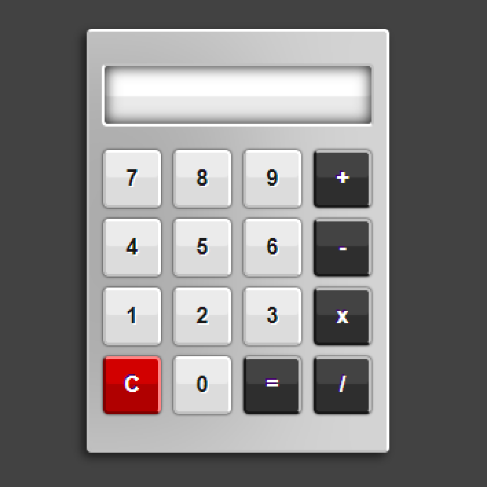

# NeoCalc

  
  
  

Este projeto faz parte de uma iniciativa pessoal de revisitar e reconstruir projetos antigos em versões mais refinadas. O objetivo é reforçar conceitos essenciais enquanto retomo os estudos, ao mesmo tempo em que evoluo tecnicamente construindo algo que, apesar de simples na proposta, carrega intencionalidade e cuidado em cada detalhe.

Como segundo projeto dessa nova fase, desenvolvi uma calculadora que integra um mini game interno. A calculadora foi pensada para cobrir lacunas comuns de usabilidade, com foco em uma experiência fluida e um design bem estruturado — daqueles que geram orgulho em cada ajuste.

Já o mini game, inspirado no clássico Dino do Chrome, foi trabalhado com foco em ritmo e sensação. A proposta aqui não é complexidade, mas sim proporcionar uma experiência envolvente e agradável, capaz de surpreender positivamente quem interage.

Durante o desenvolvimento, revisitei fundamentos importantes, fortaleci minha consistência como desenvolvedor e pratiquei lógicas que servirão de base para projetos futuros. Além disso, mantive o foco em entrega de produto, pensando não apenas na construção, mas na experiência final.

Essa nova leva de projetos representa mais do que revisão: é um processo ativo de evolução. A intenção é consolidar minha base enquanto me preparo para desafios maiores, expandindo gradualmente meu repertório e minhas capacidades técnicas.

Referência de design:
  
Resultado final:
  