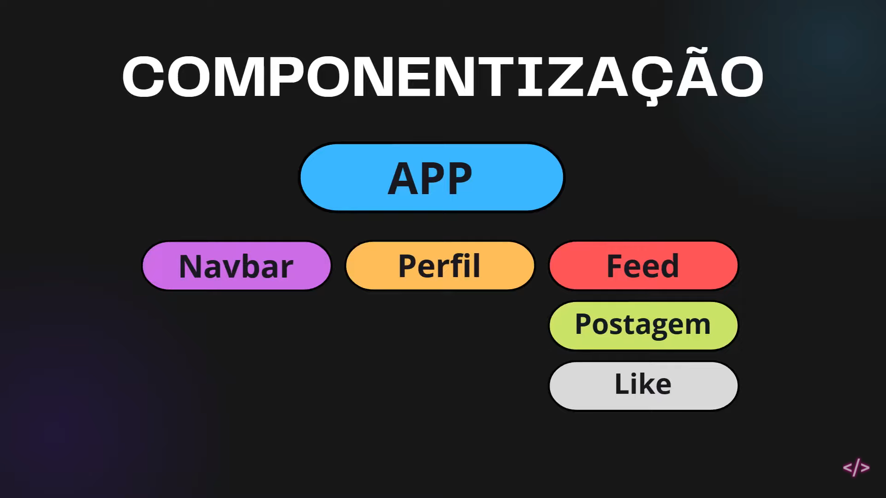

# 🏗 React

## 🤔 O que é? 

- O React é uma biblioteca Javascript;
- Foi criado pelo Facebook (atualmente Meta);
- É utilizado principalmente para construir interfaces de usuário (UI) no frontend;
- Trabalha com **componentes reutilizáveis**;
- React não é uma linguagem de programação. Ele utiliza JavaScript e pode ser utilizado com TypeScript;
- O React fornece uma abordagem baseada em componentes para o desenvolvimento de interfaces, ajudando na organização, reutilização e manutenção do código/aplicação.


## 🥊 Biblioteca VS Framework

- O React é oficialmente uma **biblioteca para interfaces de usuário**;

- Mas aí vem uma pegadinha importante, você provavelmente vai ouvir: **"React é praticamente um framework"** ou **"React é um framework frontend"**. Isso acontece porque o ecossistema React pode fornecer praticamente tudo que você precisa para construir uma aplicação;
- Mas existe uma diferença entre **React sozinho** e **ecossistema React / frameworks construídos em torno do React**. Por exemplo, Next.js é um framework baseado em React. O Next.js adiciona coisas como roteamento, renderização, estrutura de aplicação, otimizações etc.

```
React
└── biblioteca de UI


Next.js
└── framework baseado em React
``` 

- Sendo assim, **React é uma biblioteca JavaScript que traz uma abordagem de construção de interfaces de usuário baseada em componentes, proporcionando melhor organização, reutilização, manutenção e escalabilidade do código**.


## 🧩 Componetização

**Arquitetura baseada em componentes**

<br>

- Componetização é o conceito de **dividir a interface** em componentes individuais e independentes, que podem ser **reutilizados** em diferentes partes da aplicação;
- Cada componente pode receber propriedades (props), que funcionam de forma semelhante a parâmetros, permitindo **passar dados** do componente **pai** para o componente **filho** e personalizar seu conteúdo, comportamento e aparência;
- Um mesmo componente pode ser reutilizado várias vezes, recebendo props diferentes em cada utilização;
- Cada instância de um componente possui seu próprio estado, quando definido, permitindo que diferentes instâncias do mesmo componente mantenham comportamentos e dados independentes. Analogia: `componente = o molde`,  `instância do componente = uma utilização daquele molde`;
- Cada componente pode conter componentes internos, permitindo uma estrutura hierárquica e a criação de interfaces mais complexas e modulares.

